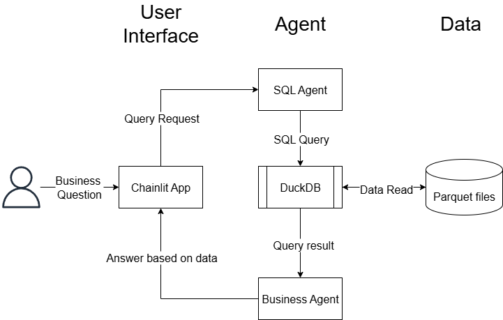

# Design Document: Data Analyst Chat Agent

## **Problem Statement**

Modern e-commerce platforms collect huge amounts of clickstream data, tracking every user interaction—from viewing a product, to adding items to a cart, to making a purchase—across thousands of products and categories. However, **extracting actionable business insights from this raw event-level data typically requires specialized analytics skills and manual database querying.**

### Challenge:
Despite the value locked in this data, **business leaders and operational teams lack an accessible, real-time way to turn raw events into insights.** This results in analytics bottlenecks that slow down tasks such as category management, campaign evaluation, and conversion optimization. Non-technical stakeholders often depend on busy data teams, creating delays and limiting the company’s ability to make timely, data-driven decisions.

### AI Transformation Objective:
To accelerate value creation, we propose building an **AI-powered data analyst chat agent**. This tool will allow business stakeholders—including category managers, marketers, and executives—to interact directly with behavioral data using plain-English questions. The agent will:

* **Understand the user's intent** and context of their question
* **Translate business questions into targeted SQL queries**
* **Extract and analyze relevant data** from the event dataset
* **Return clear explanations, tables, and visual charts** for easy consumption

By automating the translation from business questions to data-driven answers, this agent aims to **democratize data access**, shorten the analytics cycle, and drive measurable improvements in growth, margin, and customer experience.

## **Data Scope**

**Dataset:**

* **Source:** [E-commerce behavior data from multi-category store (Kaggle)](https://www.kaggle.com/datasets/mkechinov/ecommerce-behavior-data-from-multi-category-store/data)
* **Contents:**

  * Clickstream events from a major online retailer
  * **Event types:** product views, add-to-cart, remove-from-cart, and purchases
  * **Timestamps:** Second-level precision
  * **Metadata:** Product, category, brand, price
  * **Identifiers:** User and session IDs

### Prototype Subset

* **Timeframe:** The prototype uses data from **November 2019** (`2019-Nov.csv`)

  * This month offers high event volume while keeping file size manageable for rapid development
* **Categories:** All available product categories are included to support a wide range of business questions

### Data Columns

* `event_time` (timestamp)
* `event_type` (view, cart, remove\_from\_cart, purchase)
* `product_id`, `category_id`, `category_code`
* `brand`, `price`
* `user_id`, `user_session`

## **Design Choices**

This project draws on Anthropic's "Building Effective Agents" framework, which distinguishes between **workflows** (predefined sequences with tools and logic coded in advance) and **agents** (systems where an LLM dynamically decides which tools to use and how to reason through a problem).

Because our primary users—business analysts—interact in an open-ended, exploratory way, an **agent architecture** is preferred. This allows the system to dynamically determine the best process to answer diverse, unpredictable questions, rather than following a rigid workflow.

### **System Architecture**

* **Frontend:** [Chainlit](https://github.com/Chainlit/chainlit) provides a conversational chat UI
* **Agent Orchestration:** [LangGraph](https://github.com/langchain-ai/langgraph) manages LLM tool use and reasoning steps
* **AI Model:** [Claude](https://docs.anthropic.com/en/docs/about-claude/models/overview) for language understanding, SQL query synthesis, visualization code generation, and natural language explanations
* **Data Layer:** [DuckDB](https://duckdb.org/) for high-speed SQL queries directly over parquet files (no external database required)

### **Reasoning Trace & Observability**

* **Chain-of-thought tracing:** [Langsmith](https://www.langchain.com/langsmith) logs each reasoning step, providing transparency and aiding debugging

### **Tool-Calling Patterns**

The agent's core loop is:

1. **Understand user’s question and intent**
2. **Choose the right tool to get the answer**
3. **Use tools in sequence as needed**

#### **Tools Used**

* **Data LLM Tool (`query_db`):**

  * Receives the business question, data schema, and data context
  * Generates an appropriate SQL query, then runs it on DuckDB over the parquet data
  * Results are returned as tables
  * Retries up to three times with feedback (error messages and previous queries) if a query fails; if all attempts fail, the tool returns an error message
  * If unsuccessful, the main agent may reformulate the question or prompt to increase success rate

* **Visualization LLM Tool (`python_repl_loop`):**

  * Uses Langchain’s Python REPL tool, wrapped with error handling and retry logic (up to three times)
  * Receives dataframes and generates Python code to visualize them based on the user’s intent
  * Is prompted to use only for visualization tasks, not for fetching or processing raw data

## **Limitations**

### Agent Logic

* **Stochasticity:** The LLM’s reasoning is not fully deterministic—answers may vary slightly on each run
* **Cost:** The open-ended, agent-driven approach consumes more tokens (and is more costly) than narrow workflows
* **Security:** The Python REPL tool executes arbitrary Python code; while prompted to only generate visualizations, there is potential risk. The same applies to the SQL tool: if run on a real production database, permissions must be tightly scoped to read-only to prevent data corruption.

### UI/UX

* **No progress indicator:** The Chainlit UI currently does not show a “thinking” animation, so users may not know if the app is working or has crashed during a long computation
* **Image display:** There are technical challenges with reliably rendering chart images in the chat interface (current solution is a work-in-progress)
* **No conversational memory:** Each session is stateless; the chatbot does not remember prior conversation context

## **Next Steps**

* Add automated testing to systematically evaluate output quality
* Implement token caching to reduce LLM usage cost
* Develop a memory system to track user sessions and enable more contextual, multi-turn conversations

