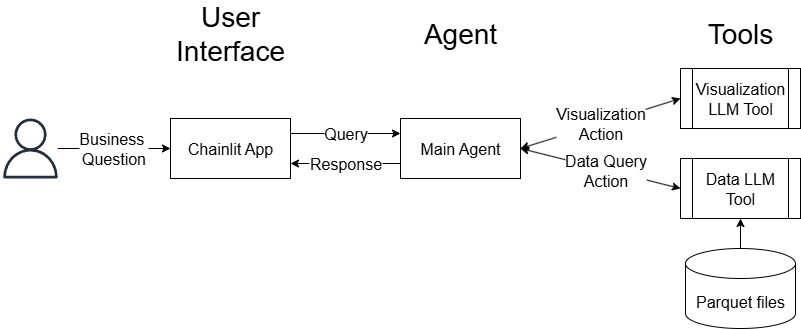

# Design Document: Data Analyst Chat Agent

## **Problem Statement**

Modern e-commerce platforms generate immense amounts of clickstream data, tracking every user interaction—from product views and cart additions to purchases—across thousands of products and categories. However, extracting actionable business insights from this raw, event-level data typically requires specialized analytics skills and manual querying.

### Challenge:
Despite the data’s potential, business leaders and operational teams lack an accessible, real-time way to turn raw events into actionable insights. Analytics bottlenecks often slow down category management, campaign evaluation, and conversion optimization.

### AI Transformation Objective:
To accelerate value creation, we are deploying an AI-powered chat analyst agent. This tool enables business stakeholders—category managers, marketers, and executives—to interact directly with the company’s behavioral data using plain-English questions. The agent automatically:

- Translates business questions into targeted SQL queries

- Extracts and analyzes relevant data

- Returns clear explanations and visualizations, empowering rapid and informed decision-making

This capability aims to democratize data access, reduce analytics cycle time, and drive measurable improvements in growth, margin, and customer experience—aligning with the PE firm’s broader digital transformation and value realization strategy.

## **Data Scope**

**Dataset:**

* [E-commerce behavior data from multi-category store (Kaggle)](https://www.kaggle.com/datasets/mkechinov/ecommerce-behavior-data-from-multi-category-store/data)
* Contains detailed clickstream data from a large multi-category online retailer, covering:

  * **Event types:** product view, add-to-cart, remove-from-cart, and purchase
  * **Event time:** timestamped at the second
  * **Product and category metadata**
  * **User and session identifiers**

**Subset Used for Prototype:**

* **Timeframe:** For this implementation, I use **November 2019** (`2019-Nov.csv`) as a representative sample
  * Balances high event volume with manageable file size for rapid prototyping and demonstration
* **Categories:** All available product categories included to maximize business question diversity

**Sample Data Columns:**

* `event_time` (timestamp)
* `event_type` (view, cart, remove\_from\_cart, purchase)
* `product_id`, `category_id`, `category_code`
* `brand`, `price`
* `user_id`, `user_session`

## **Design Choices**

For this project, I am following Anthropic’s framework from [Building Effective Agents](https://www.anthropic.com/engineering/building-effective-agents). In that blog post, Anthropic draws a key distinction between **workflows** and **agents**:

> At Anthropic, we categorize all these variations as agentic systems, but draw an important architectural distinction between workflows and agents:
>
> * **Workflows** are systems where LLMs and tools are orchestrated through predefined code paths.
> * **Agents**, on the other hand, are systems where LLMs dynamically direct their own processes and tool usage, maintaining control over how they accomplish tasks.

In this project, I imagine the user as a business analyst who is exploring and questioning the data. Because this interaction is inherently inquisitive and open-ended, I have chosen to build an **agent architecture**—rather than a traditional workflow architecture—to allow the system to dynamically determine the best way to answer the user’s questions.

### **System Architecture**

* **Frontend:** [Chainlit](https://github.com/Chainlit/chainlit) for conversational chat interface
* **Agent Orchestration:** [LangGraph](https://github.com/langchain-ai/langgraph) for managing LLM tool usage and reasoning steps
* **AI Model:** [Claude](https://docs.anthropic.com/en/docs/about-claude/models/overview) for robust language understanding, SQL query synthesis, and natural language explanation of results
* **Data Layer:** [DuckDB](https://duckdb.org/) for quickly reading data stored in parquet format using sql language without spinning up a sql server

### **Reasoning/Planning**

* **LLM-driven tool-use:** Agent interprets business question, generates relevant SQL query, executes it, summarizes results, and (optionally) visualizes insights.
* **Chain-of-thought tracing:** Each reasoning step (intent recognition, SQL construction, execution, summarization) can be logged and displayed for transparency.

### **Modularity & Extensibility**
Each component (UI, agent, model, query engine) is loosely coupled, allowing easy swapping or scaling (e.g., to a cloud warehouse, or different LLM).

System is designed for transparency (chain-of-thought), rapid experimentation, and secure handling of sensitive data.

